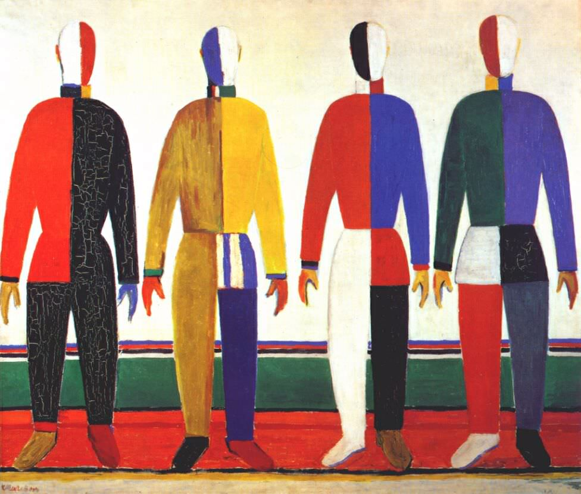
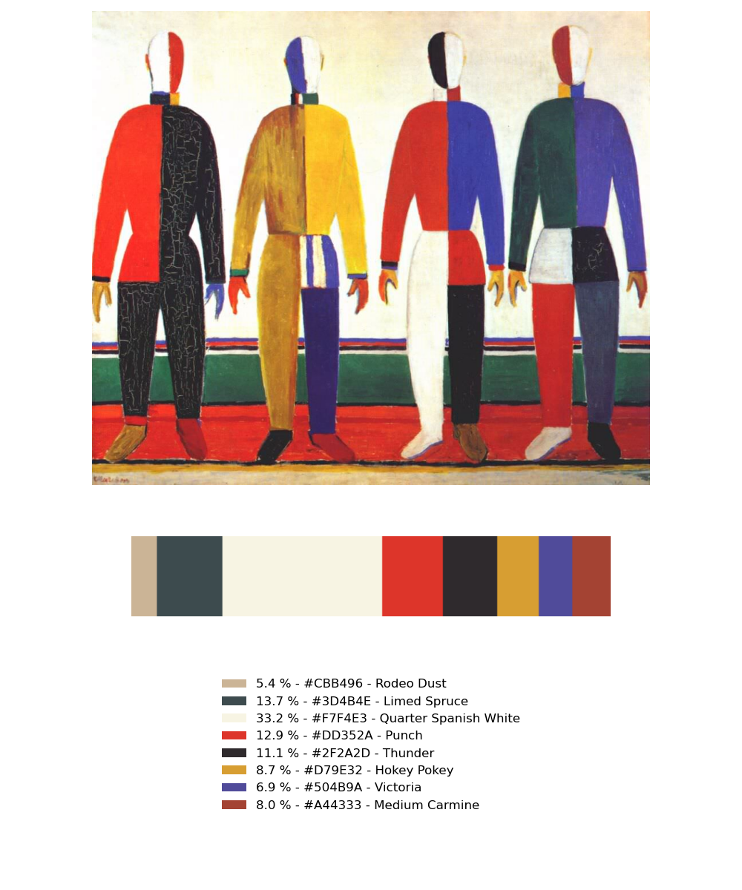
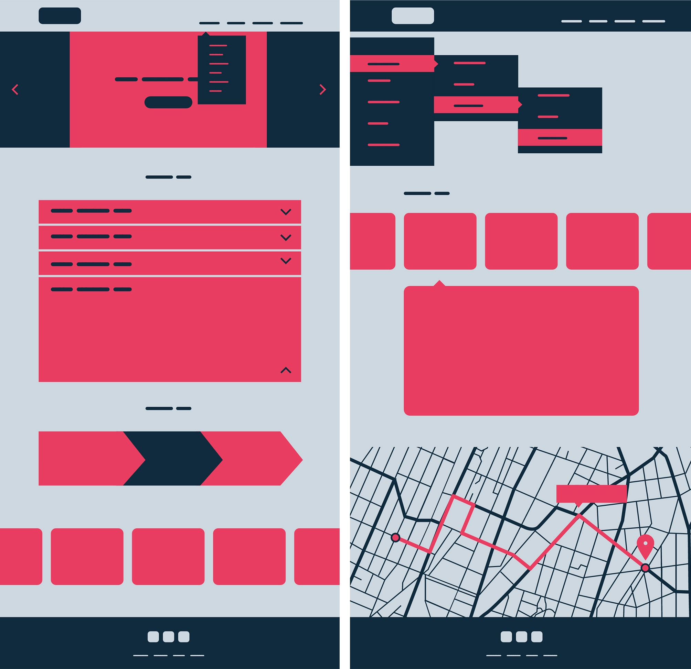
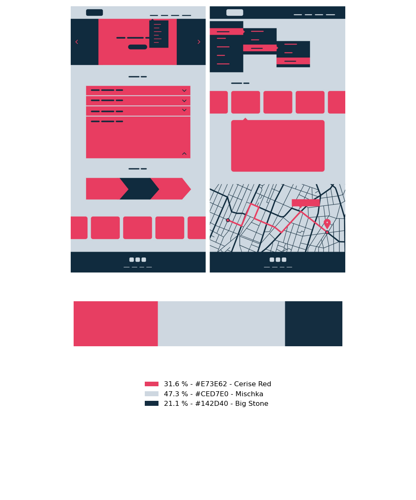
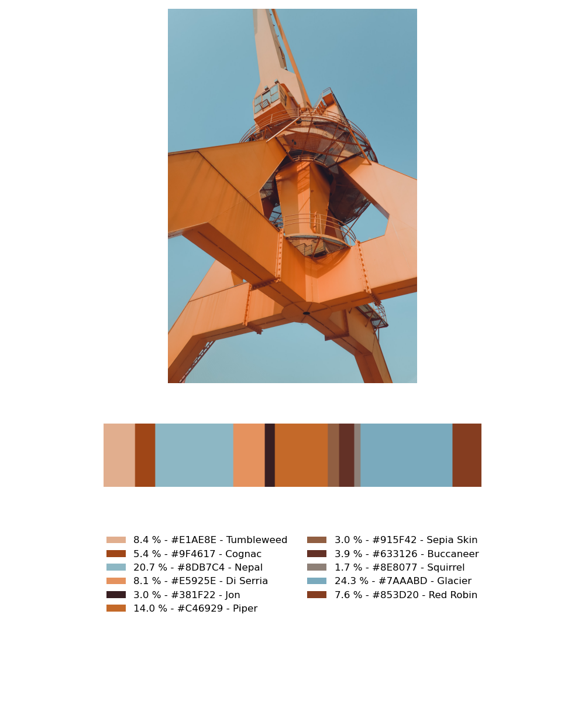

# COLORS OF PAINTINGS
___
This project implements an asynchronous telegram bot 
written using the AIOgram library. The business 
logic consists of extracting the primary colors of 
the uploaded image and returning the result as an 
infographic.

## Technologies and Tools


## Project Description

The problem of determining the primary colors in 
the image is solved by **clustering** pixels by the 
**K-Means** algorithm. The number of clusters is set 
by the user (using the pop-up keyboard in the bot). 
Based on the results of the calculations, a 
visualization is created, consisting of the 
transmitted image, the distribution of colors, a list 
with colors names, and HEX codes. The correctness of 
these modules is checked with unit tests written 
using the **Pytest** library.<br>
The business logic is placed in an asynchronous 
telegram bot written in the **AIOgram** framework. 
The bot is deployed on the **Heroku** platform.

## Project structure

```bash
.
├── examples                          # Folder with examples of processed images
│   ├── input_1.png
│   ├── input_2.bmp
│   ├── input_3.jpeg
│   ├── input_4.jpg
│   ├── output_1.png
│   ├── output_2.png
│   ├── output_3.png
│   └── output_4.png
├── images                            # Folder where images will be saved when the bot works
│   ├── input_282515396.jpg
│   └── output_282515396.jpg
├── tests                             # Folder with modules that test the work of the business logic
│   ├── infrastructure                # Sample images for running tests
│   │   ├── image_1.png
│   │   ├── image_2.webp
│   │   ├── image_3.bmp
│   │   ├── image_4.tiff
│   │   ├── image_5.jpeg
│   │   └── image_6.exr
│   ├── test_get_primary_colors.py    # Tests for module get_primary_colors.py
│   └── test_image_creation.py        # Tests for module image_creation.py
├── .gitignore                        # List of files that are not tracked by Git
├── Aptfile                           # File for downloading dependencies on heroku
├── async_business_logic_call.py      # Asynchronous access to the web application's business logic
├── bot.py                            # Logic of the Telegram bot
├── get_primary_colors.py             # Basic calculations for extracting the primary colors of an image
├── image_creation.py                 # Functions for creating infographics
├── nearest_color.pickle              # A serialized file is containing a model that maps a color RGB value to its name
├── nearest_color_by_rgb.py           # Creating nearest_color_by_rgb.py
├── Procfile                          # Specifies the commands that are executed by the app on startup
├── README.md                         # Description of the project
├── requirements.txt                  # All the required external libraries
└── rgb_color_names.csv               # Table in which each line contains RGB color values and the corresponding name
```

## How to Run the Web App

First, you need to create a file called `.env` in 
the root directory. The content of the file 
should be as follows:
```
BOT_TOKEN = 'your API telegram bot token'
HEROKU_APP_NAME = 'given by Heroku app name' # if you will deploy the bot
PORT = '443'
```

To launch the bot, run the following 
commands in the terminal:
```bash
pip install -r requirements.txt
python bot.py
```

## How to Use the Web App

If you want to test its work, then type the name 
of the bot `@colors_of_paintings_bot` in the search 
bar of *Telegram*, click on the search result, click 
on the `Start` button and follow the instructions.

You can also open the bot by clicking on the link [t.me/colors_of_paintings_bot](https://t.me/colors_of_paintings_bot).

## Examples of processed images

|<div style="width: 45%">Input Images</div> | <div style="width: 45%">Output Images</div>|
:-----------:|:-------------:
 | 
 | 
 | 
 | 
